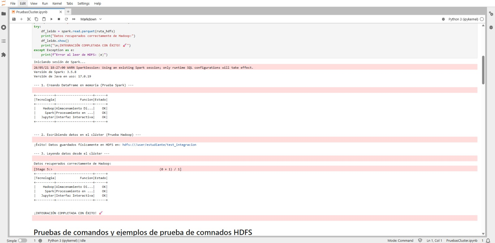

# Cluster_Hadoop_HDFS
Sistema de Ficheros Distribuido Hadoop (HDFS). En su desarrollo, se categorizan y documentan los comandos principales del clúster mediante la ejecución de ejemplos prácticos y pruebas de integración.

Es un sistema de almacenamiento organizado bajo un modelo de maestro y esclavo. Esta arquitectura se divide en dos componentes principales: 

* **NameNode:** Encargado de la orquestación y control del sistema.
* **DataNodes:** Múltiples nodos que almacenan físicamente los datos.

El sistema distribuye réplicas de la información entre los nodos, lo que garantiza tolerancia a fallos y previene la pérdida de datos.


A lo largo de este repositorio se documenta el proceso práctico de configuración, despliegue y validación de la estructura del sistema.

---

## 1. Configuración del Clúster

Para establecer el entorno de almacenamiento distribuido, ejecutamos una serie de configuraciones tanto en el nodo maestro como en los trabajadores (workers). 

### Definición de Variables de Entorno (`hadoop-env.sh`)
En primera instancia, definimos las variables críticas para el funcionamiento de Hadoop, especificando la ubicación de Java y la memoria asignada al NameNode:

| Propiedad | Propósito |
| :--- | :--- |
| `JAVA_HOME` | Ruta de instalación de Java, necesario para ejecutar Hadoop. |
| `HADOOP_PID_DIR` | Indica dónde se almacenan los archivos PID de los procesos. |
| `HADOOP_OPTS` | Agrega opciones generales (ruta de librerías nativas). |
| `HADOOP_COMMON_LIB_NATIVE_DIR` | Ubicación de las librerías nativas comunes. |
| `HDFS_NAMENODE_OPTS` | Configura opciones del NameNode (Uso de `ParallelGC` y max 4GB RAM). |


### Propiedades HDFS (`hdfs-site.xml`)
Para garantizar la tolerancia a fallos y la correcta ubicación de los bloques, establecimos los parámetros de replicación y rutas físicas:

| Propiedad | Propósito |
| :--- | :--- |
| `dfs.name.dir` | Ruta donde el NameNode almacena sus metadatos. |
| `dfs.data.dir` | Ruta local donde los DataNodes almacenan los archivos físicos. |
| `dfs.replication` | Número de copias de cada bloque (Establecido en `2`). |
| `dfs.permission` | Desactivado (`false`) para agilizar el despliegue en laboratorio. |
| `dfs.webhdfs.enabled` | Habilita el uso de WebHDFS para manipular archivos mediante peticiones web. |
| `ipc.maximum.data.length` | Límite máximo de datos para la comunicación interna IPC. |

---

## 2. Pruebas de Comandos y Ejemplos en HDFS

Una vez configurado el clúster, procedimos a validar su funcionamiento mediante un entorno interactivo en Jupyter Notebook, comprobando la comunicación entre el maestro y los esclavos.

### Pruebas de funcionamiento e integración
Validamos que los servicios de SPARK y HADOOP funcionaran de forma integrada. En este script, creamos un DataFrame en memoria y lo guardamos físicamente en HDFS, para luego recuperarlo exitosamente.



---

### Ejemplos prácticos de los comandos más comunes en HDFS
A continuación se presentan los comandos más utilizados para administrar el sistema de ficheros, ejecutados directamente en el entorno del clúster:

#### Comando 1: Creación de directorios
Genera un directorio de primer nivel para almacenar los datos. De igual manera, utilizamos la bandera `-p` para hacer recursivo el comando y crear jerarquías de carpetas automáticamente.
bash
!hdfs dfs -mkdir /folderA
!hdfs dfs -mkdir -p /folderA/experimentos/logs


#### Comando 2: Comprobación de formato correcto
Este comando base permite comprobar que el NameNode formateado tiene la estructura inicial correcta. También se usa -R para listados recursivos.
bash
!hdfs dfs -ls /
!hdfs dfs -ls -R /folderA


#### Comando 3: Transferencia de archivos locales al cluster
Transfiere un archivo local al clúster para que esté disponible para los workers utilizando la sentencia -put.
bash
!hdfs dfs -put /home/estudiante/Archivos-prueba-hdfs/Prueba.txt /folderA/


#### Comando 4: Inspección rápida de archivos
Permite inspeccionar rápidamente archivos de texto o configuraciones JSON alojadas en el clúster. También es posible visualizar solo las últimas *n* líneas usando tuberías con tail.
bash
!hdfs dfs -cat /folderA/Prueba.json
!hdfs dfs -cat /folderA/Prueba.txt | tail -n 20


#### Comando 5: Extracción de un proceso
Realiza la operación inversa (-get), permitiendo extraer la salida de un proceso hacia el entorno local. El uso de la bandera -f fuerza la sobreescritura de archivos locales existentes.
bash
!hdfs dfs -get -f /folderA/Prueba1.txt /home/estudiante/Archivos-ingreso-hdfs


#### Comando 6: Copiar datos
Mueve utilidades o datos de un espacio de trabajo a otro sin requerir descargarlos y volverlos a subir. Es ideal para crear respaldos internos (backups) garantizando un punto de restauración.
bash
!hdfs dfs -cp /folderA/Prueba1.txt /folderB/backup


#### Comando 7: Limpieza de datos o folders
Elimina los datos de un directorio de forma recursiva (-r) y forzada (-f), lo cual es vital para la automatización de limpieza en notebooks omitiendo mensajes de advertencia.
bash
!hdfs dfs -rm -r -f /folderA /folderB


## Conclusiones
 * La asignación cuidadosa de variables de entorno y recursos (como los 4GB de memoria Heap para el NameNode) permitió establecer un clúster HDFS estable y operativo durante las pruebas de estrés.
 * Las pruebas con PySpark validaron empíricamente la correcta comunicación y escritura de DataFrames en formato parquet directamente hacia el ecosistema HDFS.
 * La ejecución de este laboratorio evidenció de manera práctica la eficiencia de la arquitectura maestro-esclavo para manejar tolerancia a fallos mediante la replicación física de bloques.


```
